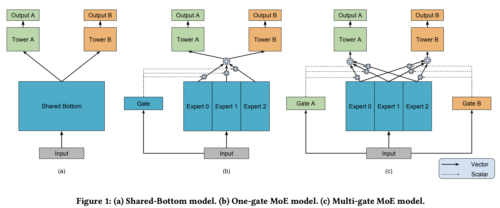

# Multi-task learning

This repository contains the implementation three architectures for multi-task learning: shared bottom (a), mixture of experts (b) and multi-gate mixture of experts (c). Multi-task learning is a paradigm where one model learns different tasks jointly by sharing some of its parameters across tasks. It allows to save on resources (compute time, memory), reduce engineering complexity and points of failure of prediction pipelines, and even improve prediction performances for tasks that are correlated where information sharing is beneficial. Nevertheless, it can also suffer from negative transfer for tasks that are too different or with contradictory objectives.

One industry application of this paradigm is to model the funnel in advertising. Inputs are usually the same for CTR and CVR tasks: user and item characteristics but the feedback and sample space differ. One can encode special properties of the funnel directly into the architecture and the loss to improve the overall performance of the system:

- encode the causal nature of the funnel: a conversion happens after a click, hence $` P(click) \geq P(conversion) `$. A penalty term can be added in the loss function to account for that.
- encode the difference in sample space: we usually are interested in predicting a conversion after a click. For a two-task problem modeling CTR and CVR, the loss could then be: $` \mathcal{L}_{ctr} + \mathcal{L}_{cvr} `$ where $` \mathcal{L}_{cvr} = -y_{ctr}y_{cvr} \cdot log( \hat{y}_{ctr}\hat{y}_{cvr} ) + (1 - y_{ctr}y_{cvr}) \cdot log (1 - \hat{y}_{ctr}\hat{y}_{cvr}) `$ such that $`\mathcal{L}_{cvr}`$ models the error for post-click conversion $`P(conversion \mid click)`$.
- have different experts for the different entities represented in the data (such as user and item) like in Two-towers architecture.

## Models



- Shared bottom is the simplest architecture. Inputs are projected to an embedding space and an encoder learns a global representation that is shared by every task. It is used as input for task-specific encoders (called towers in the litterature) that output the final predictions for every tasks.
- Mixture of experts uses an ensemble of encoders (called experts) shared by all tasks that takes a global embedding projection as input to learn different representations of the data. Each task-specific encoders take a linear combination of experts outputs as input, using a global gating mechanism. Task-specific encoders then projects it to their own task-specific space.
- Multi-gate mixture of experts is very similar to the mixture of expert model but with the difference that each tasks has its own gate. It allows to better route information of the different expert representations to the tasks as gates focus on catpuring information only relevant for their respective tasks.

In the implementation of this repository, gates are simple linear projection with a softmax activation. A temperature scaling in the softmax could be added to control the collective influence of experts. In addition, every tasks encoders have the same architecture for simplicity sake, but it can easily be adapted to fit more complex applications. Finally, a learnt linear projection is applied to the continuous vectors of inputs and before the concatenation with the learnt embeddings of discrete modalities, in order to project them into the same latent space.

An example of a simple multi-task loss is implemented in `models/loss.py`, to model multiple binary classification tasks.

## Dependencies

Thie repository has the following dependencies:

- python 3.9+
- tensorflow 2.12+

## Getting Started

```
git clone https://github.com/clabrugere/multitask-learning.git
```

## Usage

```python
# load your dataset
train_data = ...
val_data = ...

model = MultiGateMixtureOfExperts(
   dim_input=num_features,
   num_tasks=num_tasks,
   num_emb=num_embeddings,
   dim_emb=32,
)

# train the model
loss = MultiTaskBCE(num_tasks=num_tasks)
optimizer = tf.keras.optimizers.Adam()

model.compile(optimizer=optimizer, loss=loss, metrics=["mse"])
model.fit(
   train_data,
   validation_data=val_data,
   epochs=20,
)

# make predictions
y_pred = model.predict(X_test)

```

## References

- [Modeling Task Relationships in Multi-task Learning with Multi-gate Mixture-of-Experts](https://dl.acm.org/doi/pdf/10.1145/3219819.3220007)
